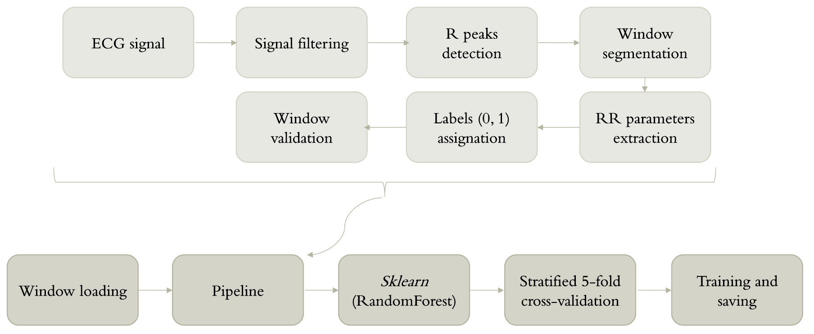
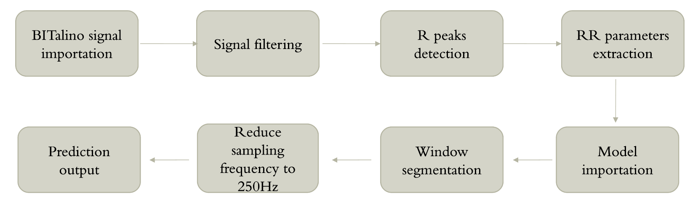

# Portable Atrial Fibrillation Detector
Atrial fibrillation (AF) is typically detected using traditional 12-lead electrocardiograms (ECG). This project presents a portable AF detection system that simplifies the conventional ECG setup to a three-lead configuration using the **BITalino** platform. Leveraging Python and machine learning, it enables reliable cardiac monitoring outside hospital settings.

The processing pipeline includes signal resampling, band-pass filtering, and QRS peak detection, followed by feature extraction and classification using a Random Forest model trained on a public ECG database. The classifier achieves an **AUC of 0.97** for AF detection on 10-second ECG segments. Currently implemented for offline analysis, the design aims toward real-time, continuous monitoring for accessible personal cardiac health management.

## Table of Contents

- [1. Features](#1-features)
- [2. Running instructions](#2-running-instructions)
- [3. Pipeline overview](#3-pipeline-overview)
- [Data source](#data-source)
- [4. License](#4-license)
---
## 1. Features

- Reads ECG signal from `.txt` exported by **OpenSignals** (BITalino)
- Applies:
  - Bandpass filter (0.5–40 Hz)
  - Notch filter (50 Hz)
-  Detects QRS peaks using `wfdb.processing.gqrs_detect`
- Extracts RR interval-based features (heart rate variability metrics):
  - Mean RR interval (average time between beats)
  - Std RR (standard deviation of RR intervals)
  - RMSSD (root mean square of successive differences)
  - pNN50 (percentage of adjacent RR intervals differing by >50 ms)
- Classifies each 10-second window as:
  - `0`: Sinus rhythm
  - `1`: Atrial Fibrillation (AF)

## 2. Running instructions
Begin by **cloning the repo**:
```bash
git clone https://github.com/consigliere0/Portable-Auricular-Fibrillation-Detector.git
cd Portable-Auricular-Fibrillation-Detector
```
It is also recommended to use a **virtual environment**. Dependencies can be installed with the following command:
```bash
pip install -r requirements.txt
```
Dependencies include:
- `numpy`
- `scipy`
- `wfdb`
- `joblib`
- `opensignalsreader`

Next up, run the main **prediction script**, `python main.py`. This will:
- Load the ECG from `source/healthy_patient_example.txt`.
- Apply filters
- Detect R peaks
- Segment signal into 10-second windows
- Run the classifier
- Print predictions for each window

## 3. Pipeline overview
The model used is a **Random Forest classifier**, trained using *scikit-learn* on RR interval features. See `model_training.py` for training code. The model file, which is implemented in the predictor script, can be found in `models/rf_af_model.joblib`.

In the following image one can see the pipeline of the model training software, which includes the `pipeline.py` and `model_training.py` codes.



As for the prediction pipeline, featured in `main.py`, the following image provides an overview of the key features.


## 4. Data source
Employed two datasets from the *PhysioNet* repository:
- https://physionet.org/content/nsrdb/1.0.0/
- https://physionet.org/content/afdb/1.0.0/#files-panel

## 5. License
This project is licensed under the GNU General Public License. See the `LICENSE` file for more info.